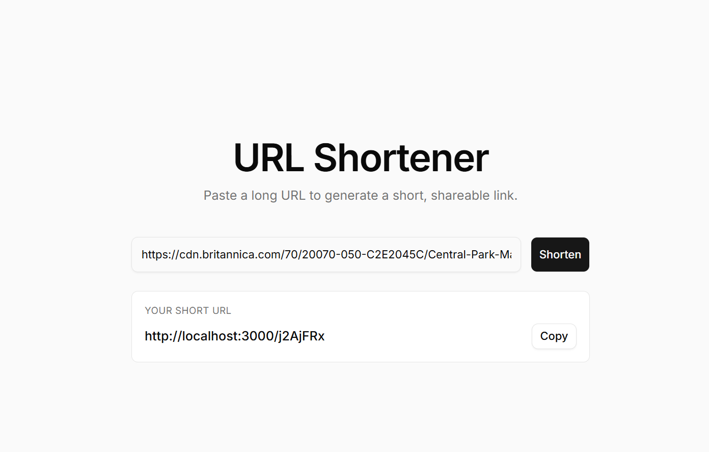

# URL Shortener

A production-style URL shortening service built with **Next.js 16 (App Router)**, **TypeScript**, **Tailwind CSS**, **shadcn/ui**, and **Supabase (Postgres)**.

The implementation follows the classic "Design a URL Shortener" system design write-up — base-62 conversion over a unique-ID generator — and hardens the well-known enumeration weakness of that approach with a bijective multiplicative cipher.

---

## Preview




---

## What this project does

- Accepts a long URL and returns a short 7-character code (`/Ab3xZ9q`).
- Resolves the short code with a single Postgres lookup and issues an HTTP `301` redirect to the original URL.
- Is **idempotent**: shortening the same long URL twice returns the same short code.
- Stops short-code enumeration: consecutive sequence IDs produce wildly different, fixed-length codes.

---

## Tech stack

| Layer            | Choice                                 |
| ---------------- | -------------------------------------- |
| Framework        | Next.js 16 (App Router, Route Handlers)|
| Language         | TypeScript (strict)                    |
| UI               | Tailwind CSS v4 + shadcn/ui            |
| Database         | Supabase (Postgres) via `@supabase/ssr`|
| ID generation    | Postgres sequence + RPC                |
| Lint / format    | ESLint (`eslint-config-next`)          |

---

## System design

### Back-of-the-envelope sizing

- 100M URLs/day → ~1,160 writes/sec, ~11,600 reads/sec (10:1 read-heavy).
- 10-year horizon → 365B records.
- `62^7 ≈ 3.5 trillion` distinct codes — enough headroom for 7-character short URLs.

### Approach picked: base-62 conversion of a unique ID

Two viable approaches:

| Approach                      | Pros                                  | Cons                                   |
| ----------------------------- | ------------------------------------- | -------------------------------------- |
| Hash + collision resolution   | Fixed length, no ID generator needed  | Per-insert DB collision check          |
| **Base-62 conversion** (ours) | No collisions, simple, deterministic  | Codes can leak the ID order (security) |

We picked base-62 conversion to avoid per-write collision checks, then **fixed the enumeration weakness** it ships with.

### Enumeration hardening — bijective multiplicative cipher

A naive `base62(sequence_id)` produces consecutive codes like `1000001`, `1000002`, etc., which lets an attacker walk the namespace. We instead compute:

```
shortCode = base62( (id * MULTIPLIER) mod 62^7 )  // left-padded to 7 chars
```

where `MULTIPLIER` is **coprime** with `62^7 = 2^7 · 31^7` (odd and not divisible by 31). That makes the mapping `id → shortCode` a **bijection** over the 7-character address space:

- Every distinct `id` produces a distinct code — **no collisions possible**.
- Consecutive IDs land at completely different points in the namespace.
- One Postgres round-trip per insert, no collision-retry loop.

See [`lib/shortcode.ts`](lib/shortcode.ts) for the implementation.

### Redirect: `301` vs `302`

The handler returns `301` (permanent). Browsers cache the redirect, so subsequent clicks bypass our server entirely — lower load, faster for the user. Switch to `302` if you need every click for analytics.

### Cache / replication / sharding

Deliberately **not** implemented in this build. Single-region Supabase is sufficient at this scale; Redis in front of the DB and read replicas are the natural next steps.

---

## Architecture

```
                   ┌──────────────────────────┐
   POST /api/v1/   │ app/api/v1/data/shorten/ │
   data/shorten ──▶│ route.ts                 │
                   └────────────┬─────────────┘
                                │
                                ▼
                   ┌──────────────────────────┐         ┌──────────────────┐
                   │ lib/urls.ts              │  RPC    │ next_url_id()    │
                   │  - findByLongUrl         │────────▶│ (nextval)        │
                   │  - createShortUrl ──────────────┐  └──────────────────┘
                   │  - findByShortUrl               │
                   └────────────┬─────────────┘      │
                                │                    │
                                ▼                    ▼
                   ┌──────────────────────────────────────┐
                   │ Supabase Postgres                    │
                   │  table: urls(id, short_url, long_url)│
                   │  seq:   url_id_seq                   │
                   └──────────────────────────────────────┘
                                ▲
   GET /:shortUrl ──┐           │
                    ▼           │
                   ┌──────────────────────────┐
                   │ app/[shortUrl]/route.ts  │
                   │  → 301 redirect          │
                   └──────────────────────────┘
```

### Write path (shorten)

1. Client `POST /api/v1/data/shorten` with `{ longUrl }`.
2. Validate URL (http/https only).
3. Check Supabase for an existing row with that `long_url` → return it if present (idempotency).
4. `rpc('next_url_id')` atomically pulls the next bigint from `url_id_seq`.
5. `idToShortCode(id)` obfuscates and base-62 encodes to a 7-char string.
6. Insert `{ id, short_url, long_url }` and return `{ shortUrl, longUrl }`.

### Read path (redirect)

1. Client `GET /:shortUrl`.
2. Validate the code only contains base-62 characters.
3. Single Postgres lookup by `short_url` (primary index).
4. Return `301` with `Location: longUrl`, or `404` if not found.

---

## API

### `POST /api/v1/data/shorten`

```http
POST /api/v1/data/shorten
Content-Type: application/json

{ "longUrl": "https://en.wikipedia.org/wiki/Systems_design" }
```

```json
{
  "shortUrl": "Ab3xZ9q",
  "longUrl": "https://en.wikipedia.org/wiki/Systems_design"
}
```

| Status | Meaning                                |
| ------ | -------------------------------------- |
| 200    | Returned existing or newly created code |
| 400    | Missing / invalid / non-http(s) URL    |
| 500    | Database error                          |

### `GET /:shortUrl`

```http
GET /Ab3xZ9q
```

```http
HTTP/1.1 301 Moved Permanently
Location: https://en.wikipedia.org/wiki/Systems_design
```

| Status | Meaning                  |
| ------ | ------------------------ |
| 301    | Permanent redirect       |
| 404    | Unknown / invalid code   |

---

## Project structure

```
url-shortner/
├── app/
│   ├── api/v1/data/shorten/route.ts    # POST handler — create short URL
│   ├── [shortUrl]/route.ts             # GET handler — 301 redirect
│   ├── layout.tsx
│   ├── page.tsx                        # Landing page with shortener form
│   └── globals.css
├── components/
│   ├── url-shortener-form.tsx          # Client component, calls /api/v1
│   └── ui/                             # shadcn/ui primitives (Button, Input)
├── lib/
│   ├── base62.ts                       # Base-62 encode / decode / validate
│   ├── shortcode.ts                    # Bijective id → 7-char code
│   └── urls.ts                         # Supabase data access layer
├── utils/supabase/
│   ├── server.ts                       # Server-side Supabase client
│   ├── client.ts                       # Browser Supabase client
│   └── middleware.ts                   # Session-refresh helper
├── supabase-schema.sql                 # One-shot DB setup
└── .env.local.example
```

---

## Getting started

### 1. Install dependencies

```bash
npm install
```

### 2. Set up Supabase

Create a project at [supabase.com](https://supabase.com), then open **SQL Editor → New query** and run [`supabase-schema.sql`](supabase-schema.sql). It creates:

- `public.urls` table (`id`, `short_url`, `long_url`, `created_at`)
- `public.url_id_seq` sequence (start = 1)
- `public.next_url_id()` RPC function
- Row-level security policies for the anon (publishable) key

### 3. Configure environment

Copy [`.env.local.example`](.env.local.example) to `.env.local` and fill in your project's URL and publishable key (Supabase dashboard → **Project Settings → API**):

```env
NEXT_PUBLIC_SUPABASE_URL=https://<your-project-ref>.supabase.co
NEXT_PUBLIC_SUPABASE_PUBLISHABLE_KEY=sb_publishable_xxxx
```

### 4. Run the dev server

```bash
npm run dev
```

Open [http://localhost:3000](http://localhost:3000), paste a URL, and shorten away.

### Scripts

| Command         | What it does                  |
| --------------- | ----------------------------- |
| `npm run dev`   | Start the dev server          |
| `npm run build` | Production build              |
| `npm run start` | Serve the production build    |
| `npm run lint`  | ESLint                        |

---

## What I'd build next

Natural progression from the current single-region build:

- **Redis read-through cache** in front of Supabase. Reads are 10× writes; caching `shortUrl → longUrl` for hot links would offload the DB.
- **Rate limiter** at the shorten endpoint, keyed by IP, to stop abuse.
- **Bloom filter** to short-circuit lookups for invalid short codes before hitting the DB.
- **Analytics**: switch the redirect to `302` and write click events (timestamp, referrer, geo) to a separate `clicks` table.
- **Read replicas / sharding** once a single Postgres can't keep up.
- **Custom aliases & expiry** as user-facing features.
